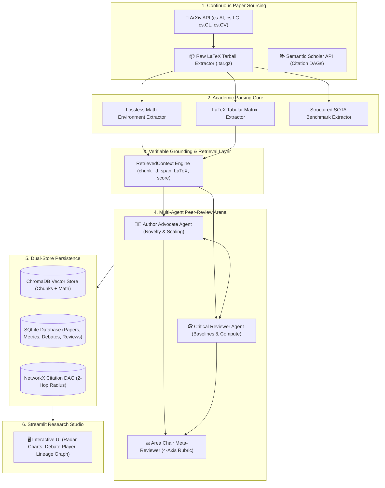

# 🏗️ PaperPulse AI — System Architecture & Engineering Specifications

### Autonomous Multi-Agent Academic Paper Discovery, Adversarial Peer-Review & Lineage Graph

---

## 1. Executive Summary & Problem Formulation

Academic research in machine learning has reached a throughput exceeding 2,500 arXiv papers weekly. Standard LLM-based paper summarizers fail due to three fundamental limitations:
1. **Lossy PDF Parsing**: Multi-column PDF extractors scramble tables, math notations, and equations.
2. **Uncalibrated Hallucinations**: Standard chat models accept paper claims uncritically without probing baseline fairness or compute FLOPs.
3. **Missing Architectural Lineage**: Failure to trace conceptual ancestry across foundational precursors.

**PaperPulse AI** resolves this via a multi-agent peer-review architecture powered by **raw LaTeX extraction**, **cyclic adversarial debate**, and **interactive 2-hop citation DAGs**.

---

## 2. End-to-End System Architecture

---

## 3. Mathematical Formulations & Multi-Agent State Machine

### A. Provenance Grounding Scoring
For each argument $A_t$ generated at round $t$, a set of verifiable grounding contexts $C = \{c_1, c_2, \dots, c_k\}$ is retrieved such that:

$$\text{Sim}(A_t, c_i) = \frac{\mathbf{e}(A_t) \cdot \mathbf{e}(c_i)}{\|\mathbf{e}(A_t)\| \|\mathbf{e}(c_i)\|} \ge \tau_{\text{sim}}$$

Where $\mathbf{e}(\cdot)$ represents the 384-dimensional dense embedding space (`sentence-transformers/all-MiniLM-L6-v2`) and $\tau_{\text{sim}} = 0.35$ represents the minimum factual relevance threshold.

### B. Calibrated 4-Axis Rubric Formulation
The Area Chair Meta-Reviewer computes the final verdict using a weighted multi-axis rubric:

$$\text{Overall Score} = \frac{1}{4} \left( S_{\text{novelty}} + S_{\text{rigor}} + S_{\text{fairness}} + S_{\text{reproducibility}} \right)$$

* $S_{\text{novelty}} \in [1.0, 10.0]$: Mathematical originality and theoretical framing.
* $S_{\text{rigor}} \in [1.0, 10.0]$: Empirical dataset coverage and statistical confidence.
* $S_{\text{fairness}} \in [1.0, 10.0]$: Baseline parity across parameter and FLOP budgets.
* $S_{\text{reproducibility}} \in [1.0, 10.0]$: Open-source code availability, weights, and hyperparameter disclosure.

---

*PaperPulse AI — System Architecture Specification.*
