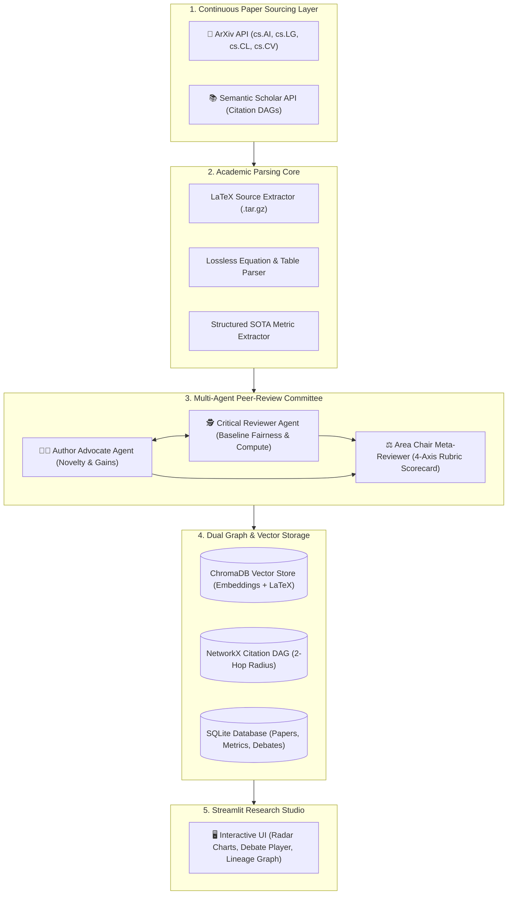

# 🔬 PaperPulse AI — Autonomous Multi-Agent Academic Discovery & Peer-Review Arena

<div align="center">

### *Autonomous ArXiv Sourcing • Adversarial Peer-Review Committee • 2-Hop Citation Lineage DAG*

[](https://www.python.org/)
[](https://streamlit.io/)
[](https://www.trychroma.com/)
[](https://networkx.org/)
[](https://opensource.org/licenses/MIT)

**A frontier AI research intelligence platform that autonomously monitors arXiv, extracts SOTA benchmarks into structured tables, pits adversarial AI agents in peer-review debates, and graphs the evolutionary lineage of deep learning architectures.**

[🚀 Quickstart](#-quickstart--installation) • [🏛️ System Architecture](#️-system-architecture) • [⚔️ Peer-Review Arena](#️-adversarial-peer-review-arena) • [🕸️ Citation Lineage](#️-interactive-citation-lineage-dag) • [🎨 Themes & UI](#-bespoke-theme-engine)

---

</div>

## 📌 Executive Overview

Over 2,500 machine learning papers are published to arXiv every week across `cs.AI`, `cs.LG`, `cs.CL`, and `cs.CV`. Researchers face critical bottlenecks:
1. **Information Overload**: Distinguishing true breakthroughs from incremental benchmark overfitting.
2. **Missing Architectural Lineage**: Unclear evolution from foundational precursors (e.g. *HiPPO $\rightarrow$ S4 $\rightarrow$ Mamba*).
3. **Unreliable RAG Parsing**: Standard PDF extraction destroys two-column tables and mathematical LaTeX formulas (`\begin{equation}`).

**PaperPulse AI** solves this with:
* **LaTeX-First Academic Parsing**: Extracts clean LaTeX source `.tar.gz` directly from arXiv for lossless math equations and benchmark tables.
* **LangGraph Multi-Agent Peer-Review Debate**: Pits an **Author Advocate Agent** 🧑‍🔬 against a **Critical Reviewer Agent** 🕵️ across 2 debate rounds before an **Area Chair Meta-Reviewer** ⚖️ computes a 4-axis calibrated rubric scorecard (Novelty, Rigor, Fairness, Reproducibility).
* **2-Hop Citation Lineage DAG**: Visualizes ancestor papers and foundational precursors in an interactive PyVis physics graph.

---

## 🏛️ System Architecture



---

## ⚡ Core Capabilities & Highlights

| Feature | Technical Implementation |
| :--- | :--- |
| **⚔️ Multi-Agent Debate Arena** | Cyclic 2-round structured argumentation between Author Advocate and Critical Reviewer with an Area Chair Meta-Reviewer verdict. |
| **🕸️ Interactive Lineage DAG** | 2-hop radius directed citation graph with PyVis physics simulation highlighting seed, 1-hop, and 2-hop foundational works. |
| **📊 SOTA Benchmark Extractor** | Automated structured metric extraction across MMLU, GSM8K, HumanEval, and ImageNet with baseline delta tracking ($\Delta$). |
| **📜 Lossless LaTeX Inspector** | Direct math environment extraction preserving equations like $\mathcal{L}_{\text{NTP}}$ and softmax attention matrices. |
| **🎨 5 Bespoke Luxury Themes** | Cyber Academic (Dark), Deep Quantum Obsidian (Dark), Emerald Scholar (Dark), Nordic Research Slate (Light), Royal LaTeX (Light). |

---

## 🚀 Quickstart & Installation

```bash
# 1. Clone or navigate to the repository
cd /Users/siva/AI-codebase/PaperPulse_AI

# 2. Install dependencies
pip install -r requirements.txt

# 3. Launch the Research Studio
streamlit run app.py
```
Open **`http://localhost:8501`** in your browser.

---

## 📁 Repository Layout

```
PaperPulse_AI/
├── agents/
│   ├── advocate_agent.py         # Author Advocate Agent
│   ├── critic_agent.py           # Critical Reviewer Agent
│   ├── meta_reviewer.py          # Area Chair Meta-Reviewer
│   └── debate_engine.py          # Cyclic Multi-Agent Debate Controller
├── ingestion/
│   ├── arxiv_client.py           # ArXiv API & LaTeX Source Downloader
│   ├── latex_parser.py           # Equation & Section Parser
│   └── semanticscholar_client.py # Citation Count & Reference DAG Client
├── rag/
│   ├── embeddings.py             # Local SentenceTransformers (all-MiniLM-L6-v2)
│   ├── vector_store.py           # ChromaDB Hierarchical Store
│   └── llm_client.py             # Multi-Provider LLM Fallback (Gemini, OpenAI, Groq, Local)
├── graph/
│   └── lineage_graph.py          # 2-Hop NetworkX + PyVis Citation DAG
├── storage/
│   └── db.py                     # SQLite Database (Papers, Metrics, Debate Turns, Reviews)
├── ui/
│   ├── components.py             # Radar Scorecard, Paper Cards, Debate Bubble Cards
│   └── theme_manager.py          # 5 Bespoke Theme Palettes & Dynamic CSS
├── app.py                        # Streamlit Interactive Research Studio
├── config.py                     # Global Configuration & Parameter Defaults
├── models.py                     # Pydantic v2 Data Schemas
├── requirements.txt              # Pip Dependencies
└── README.md                     # Documentation
```

---

## 📄 License
Distributed under the **MIT License**.
